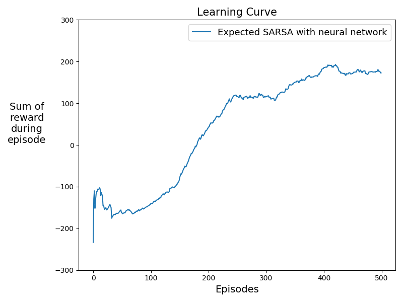

# Expected Sarsa-LunarLander-v2-Python

Python Implementation of [Expected Sarsa](http://www.cs.ox.ac.uk/people/shimon.whiteson/pubs/vanseijenadprl09.pdf) for [LunarLander-v2](https://gym.openai.com/envs/LunarLander-v2/)

## Dependencies

- python 3.7
- numpy 1.18.1
- gym 0.17.2

## Results

Initial     |   After 200 episodes  |   After 500 episodes  
:-------------------------:|:-------------------------:|:-------------------------:
  |   |   

## Plot

